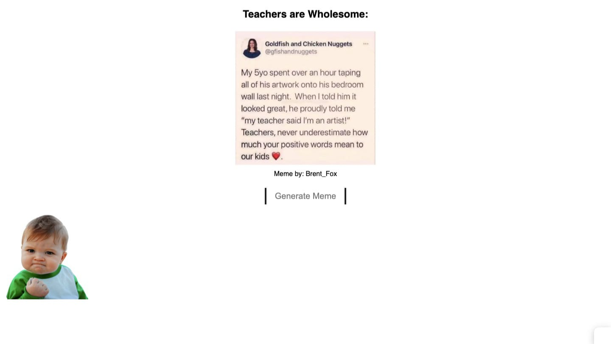

# Image Generator

> Bu projeyi JavaScript pratiği yapmak için oluşturdum.

> Canlı Proje [_tıkla_](https://meme-generator-delta-self.vercel.app/).

## İçerik
- [Image Generator](#image-generator)
  - [İçerik](#i̇çerik)
  - [Genel Bilgi](#genel-bilgi)
  - [Kullanılan Teknolojiler](#kullanılan-teknolojiler)
  - [Features](#features)
  - [Projeye Bakış](#projeye-bakış)
  - [Proje Durumu](#proje-durumu)
  - [Bilgilendirme](#bilgilendirme)
  - [İletişim](#i̇letişim)
  - [License](#license)

## Genel Bilgi
Projeyi klonladıktan sonra live server kullanarak localinizde çalıştırabilirsiniz.

## Kullanılan Teknolojiler
- HTML
- CSS
- JavaScript

## Features
- İsteğe ve açılan issue'lere bağlı olarak features eklenecektir. Proje bitmiştir.

## Projeye Bakış

## Proje Durumu
Proje bitti.

## Bilgilendirme
- Bu proje JavaScript'te pratik yapmak amacıyla oluşturuldu.

## İletişim
[Twitter - @busenurcetin16](https://twitter.com/busenurcetin16) tarafından projenin arayüzü yapıldı.

## License 
Bu proje GNU General Public lisansı altında açık kaynak olarak paylaşılmıştır.